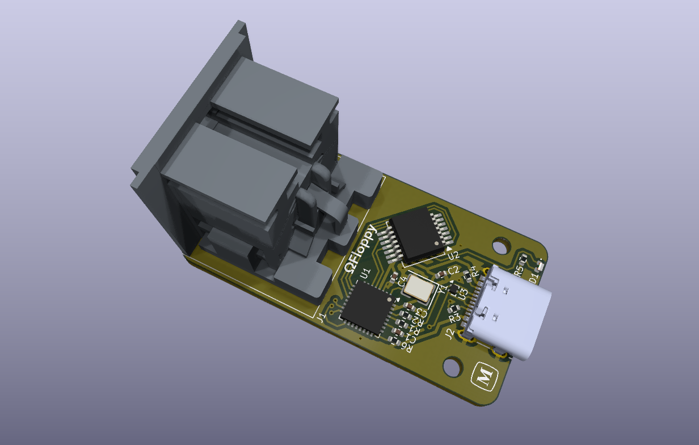
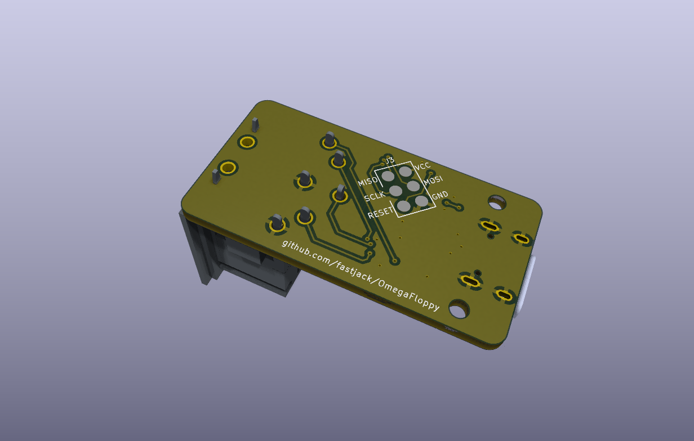

# ΩFloppy

A modernized version of XUM1541 with USB-C. Based on the design of the [ZoomFloppy](https://github.com/go4retro/ZoomFloppy) but stripped of all the "weird" connectors.

## Images

Yes, I am aware that the two pins of the DIN connector do not line up with the footprint. This is a problem with Lumberg's CAD model (I contacted them about it). I have [verified](images/footprint-test.jpeg) the footprint with the real connector.

## WARNING!
This PCB is still untested. First PCBs have been ordered.

This KiCAD project was created with a nightly build of KiCAD 10.99. The current release of KiCAD 10 (Version 10.0.6 as of this writing) will most certainly not open the project.
